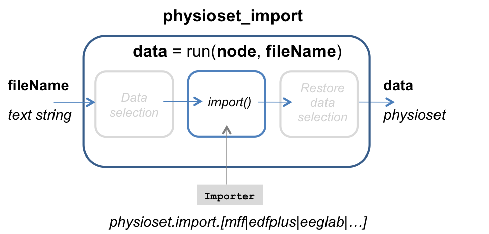
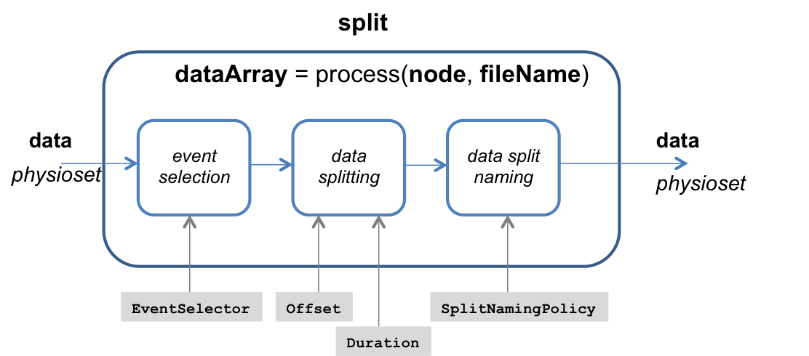
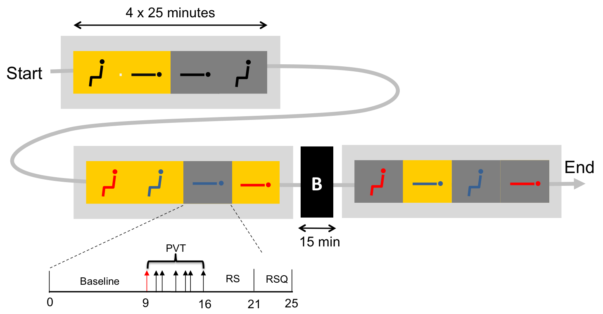

Split raw data files
===

The raw data files that we just [linked to in the previous step][getting_raw]
of this tutorial are very large: about 30 GB each. It is certainly possible to
use `meegpipe` to work with such large files directly, but it is generally
a good idea to try to work with smaller chunks of your data at a time, if that
makes sense for your particular analysis. Otherwise, you may need to wait a long
for every processing stage to complete on a given file.

In this tutorial we want to extract features for each experimental condition
separately. Thus, it makes sense to split our original data files into 12
single-block files, each containing just one experimental manipulation.
`meegpipe` allows you to process files into parallel jobs and thus breaking
your files into 12 smaller chunks has the potential of reducing computation
times considerably.

In the code snippets shown below I assume that your MATLAB search is set to
its default value. You can ensure that this is the case by executing the
following command when you start MATLAB:

````matlab
restoredefaultpath;
````


[getting_raw]: ./getting_raw_data.md


## Keeping your scripts organized

We are going to wrap all the scripts necessary to perform the file splitting
into a MATLAB package called `batman`. Open MATLAB and type:

````matlab
cd /data1/projects/meegpipe/batman_tut/gherrero
mkdir +batman
````

From now on we will save all scripts under `+batman`.


## Main processing script

Before writing our data processing pipeline we are going to write the scheleton
of our _main_ processing script where we perform the necessary preliminaries,
and where we run the pipeline (which we will write later) on the relevant data
files. Below you can see a profusely commented example of how such a
[split_files.m][split_files_m] script may look like:

[split_files_m]: ./split_files.m

````matlab
% SPLIT_FILES - Split BATMAN's large .mff files into single-block files
%
% This is the first stage of the BATMAN processing chain. The input to this
% stage are the raw .mff files. The produced output is a set of
% single-block .pset/pseth files (meegpipe's own data format). By
% single-block we mean a single condition block (Baseline, PVT, RS, RSQ)
% within a given experimental manipulation.


% Start in a completely clean state
close all;
clear all;
clear classes;

% Initialize meegpipe
meegpipe.initialize;

% The output directory where we want to store the splitted data files
OUTPUT_DIR = '/data1/projects/meegpipe/batman_tut/gherrero/split_files_output';

% Some (optional) parameters that you may want to play with when experimenting
% with your processing pipeline
PARALLELIZE = true; % Should each file be processed in parallel?
DO_REPORT   = true; % Should full HTML reports be generated?

% Create an instance of your data splitting pipeline
myPipe = batman.split_files_pipeline(...
    'GenerateReport', DO_REPORT, ...
    'Parallelize',    PARALLELIZE);

% Note that we have not yet written function splitting_pipeline!

% Generate links to the relevant data files into the output directory. This
% step is equivalent to copying the relevant data files into the output
% directory but has the advantage of saving valuable disk space. The
% command below will only work at somerengrid.
files = somsds.link2rec(...
            'batman', ...           % The recording ID
            'subject', [1 2], ...   % The subject ID(s)
            'modality', 'eeg', ...  % The data modality
            'folder',  OUTPUT_DIR); % The directory where the links will be generated


% files should now be a cell array containing the full paths to the files
% that are to be splitted (or, rather, the full paths to the symbolic links
% that point to those files).

% This is kind of obvious...
run(myPipe, files{:});
````


## The splitting pipeline


Our `split_files.m` above made used of certain `batman.split_files_pipeline`
that took care of creating an instance of the data processing pipeline. It is
now time to write that function.


### Node 1: Importing the `.mff` files

Obviously, the first step in our processing pipeline needs to be converting the
raw `.mff` files into [physioset][physioset] objects, which is the data
structure that _meegpipe_'s processing nodes understand.

[physioset]: ../../+physioset/@physioset/README.md

Importing data from various disk file formats into a _physioset_ object is
always performed with a [physioset_import][physioset_import_node] node. Below
you have a schematic diagram of such a node:

[physioset_import_node]: ../../+meegpipe/+node/+physioset_import/README.md



__NOTE:__ In the diagram above I have depicted also the _data selection_ steps
that take place before and after the actual node processing. These steps are
common to all classes of processing nodes and, in the following, they will not
be shown in the node diagrams. See the documentation of the generic [node][node]
interface for more information.

[node]: ../../+meegpipe/+node/README.md

Nodes of class `physioset_import` admit only one configuration option,
_Importer_. The user needs to set it to an object of one of the physioset
importer classes that are available in package [physioset.import][physioset_import_pkg].
For instance, you may use a `physioset.import.edfplus` object for
importing [EDF+][edfplus_format] files. In our case, the raw data files are in
`.mff` format and thus we need a `physioset.import.mff` importer.

Realize that, although the `physioset_import` node has just one configuration
option (_Importer_), the actual data importer object has several properties that
allow you to specify various importing options. Let's build a _default_ mff
importer object to find out what properties it has:

[physioset_import_pkg]: ../../+physioset/+import/README.md
[edfplus_format]: http://www.edfplus.info/

````matlab
>> physioset.import.mff

ans =

mff
Package: physioset.import


      ReadDataValues : true
           Precision : double
            Writable : true
           Temporary : true
           ChunkSize : 500000000
   AutoDestroyMemMap : false
          ReadEvents : true
            FileName :
          FileNaming : inherit
             Sensors : []
        EventMapping : [1x1 mjava.hash]
          MetaMapper : @(data)regexp(get_name(data),'(?<subject_id>0+\d+)_.+','names')
         EventMapper : []
           StartTime :
````

One property that you may often want to override is the `Precision` property,
which determines the numeric precision that is used to store the values
contained in the generated `physioset` object. The code below will create a
`physioset_importer` node that will convert an `.mff` data file into
a `physioset` object of `single` precision:

````matlab
% This import directive allows us to write physioset_import.new instead of the
% fully qualified name meegpipe.node.physioset_import.new. You only need to run
% this directive once (within a given MATLAB session), unless you run command
% "clear all", which also clears the current import list.
import meegpipe.node.*;

% Let's build our data importer with a custom Precision value
myImporter = physioset.import.mff('Precision', 'single');

% Now, let's build a physioset_import node that uses the importer object above
myNode = physioset_import.new('Importer', myImporter);
````

And that's it for the first node in our file splitting pipeline. Let's move on
to the next node.


### Node 2: Splitting the imported physioset

Nodes of class [split][split_node] allow you to split a physioset object into
several (possible overlapping) data subsets. Below you have the node schema:

[split_node]: ../../+meegpipe/+node/+split/README.md





Nodes of class `split` determine the time range of each data split by selecting
a subset of events among the events present in the input physioset. The subset
of relevant events is selected using a user-defined `EventSelector`. To
understand how this works, let's take a look at the default value of
`EventSelector`:

````matlab
defEvSel = get_config(split.new, 'EventSelector')

ans =

class_selector
Package: physioset.event


               Class : { 'split_begin'}
                Type : {}
             Negated : false
                Name :
````

So, by default, the `split` node looks for `split_begin` events in the input
physioset and splits the dataset according to the `Offset` and `Duration` of
such events. The example below illustrates this behavior with a random toy
physioset:

````matlab
import meegpipe.node.*;

% Create a toy physioset object that contains random values
myImporter = physioset.import.matrix('FileName', 'mytoydata');
myPhysioset = import(myImporter, rand(3,1000));

% In your current directory there should now be a file called `mytoydata.pset`
% which contains the physioset data values.

% Add two split_begin events at samples 100 and 500, with a duration of 500 samples
myEvArray = physioset.event.std.split_begin([100 500], 'Duration', 500);
add_event(myPhysioset, myEvArray);

% Split it!
myNode = split.new;
run(myNode, myPhysioset);
````

The messages displayed in the MATLAB command window should provide you all the
details regarding the two data splits that were just generated. The same
information together with instructions on how to retrieve the produced data
splits is found in the HTML report generated by the `split` node. Open the
report and click on the _Split mytoydata_split1_ link, under the _Produced data
splits_ section. At the bottom of the page you will find the code snippet that
you need to retrieve the first split physioset. In my case the code snippet
reads:

````matlab
data = pset.load(['/Volumes/DATA/work/' ...
    'mytoydata.meegpipe/split-3fa41e_gherrero_MACI64-R2012a/' ...
    'mytoydata_split1.pseth'])
````

Let's check whether the first split contains the expected values:

````matlab
% The first split should contain these data values:
myManualSplit1 = myPhysioset(:, 100:599);

% This should not throw an error if everything went OK
assert(all(data(:)==myManualSplit1(:)));
````

#### Splitting strategy for the BATMAN recordings

For various practical reasons related with issues that occured during the
recordings of the BATMAN dataset, the only events that we can reliably use to
produce the desired data splits in all files are the `PVT` events. Namely, the
first `PVT` event within a given manipulation block can be used to determine the
onset of the `PVT` sub-block:



Thus we can use the following strategy to split the files:

1. Select the first `PVT` event within every _PVT_ sub-block. This step should
   produce 12 such events.

2. For each event selected in 1., let's assume that the time of the event is `t`.
   Then, produce four splits:

Split name                     | Offset from `t` (mins) | Duration (mins)
------------------------------ | ---------------------- | ------------------
`[dataName]_baseline_[block#]` | -9                     | 9
`[dataName]_pvt_[block#]`      |  0                     | 7
`[dataName]_rs_[block#]`       |  7                     | 5
`[dataName]_rsq_[block#]`      | 12                     | 4


#### Splitting strategy implementation

The most complex aspect of our splitting strategy is how to robustly identify
the first `PVT` event within a given _PVT_ sub-block. The details are beyond the
scope of this tutorial, but suffice to say that function
[pvt_selector][pvt_selector] implements an event selector that will do the job.
You can use the latter as a model for your own custom event selectors.

[pvt_selector]: ./+batman/pvt_selector.m

One detail that is still missing is how to ensure that the produced splits are
given meanigful names. E.g. we would like the _RS_ split for the second
experimental manipulation block of file `batman_0001_eeg_all.mff` to be called
`batman_0001_eeg_all_rs_2`. Node _split_ names the generated splits according to
a user-defined naming function (configuration option `SplitNamingConvention`.
Such a naming function is provided as arguments the physioset object that enters
the `split` node, the relevant splitting event, and the index of such event
within the set of all splitting events. For more details, you may take a look
at function [split_naming_policy][split_naming].

[split_naming]: ./+batman/split_naming_policy.m

Using our custom event selector we could define a `split` node that would split
away all _baseline_ sub-blocks as follows:


````matlab
import meegpipe.node.*;

% Create an instance of the custom event selector that selects the first PVT
% event within every PVT sub-block.
myEvSel = batman.pvt_selector;

% Just trust me on this one...
splitNaming = @(physObj, ev, evIdx) ...
    batman.split_naming_policy(physObj, ev, evIdx, 'baseline');

% This is not really required, but since in this tutorial we are not interested
% in the EEG data, it is a good idea to select only non-EEG data when generating
% the splits so that we have as small data splits as possible. Notice the
% ~ symbol, which means: select everything except EEG data. What is the
% ~ symbol does is to "negate" a data selector so that it selects the
% complementary set that it would normally select. You can check whether a data
% selector has been negated by inspecting the value of it Negated property.
myDataSel = ~pset.selector.sensor_class('Class', 'EEG');

% Create the split node. It is important to give a meaningful name to the node.
myNode = split.new(...
    'DataSelector',      myDataSel, ...
    'EventSelector',     myEvSel, ...
    'Offset',            -9*60, ...         % Must be in seconds
    'Duration',          9*60, ...          % Also in seconds
    'SplitNamingPolicy', splitNaming, ...
    'Name',             'baseline', ...

````

### Putting it all together

Below the contents of function [split_files_pipeline.m][split_files_pipeline],
which create the pipeline that we need to split the BATMAN files as required.

[split_files_pipeline]: ./+batman/split_files_pipeline.m

````matlab
function myPipe = split_files_pipeline(varargin)
% SPLIT_FILES_PIPELINE - Splits BATMAN .mff files into single sub-block files

import meegpipe.node.*;

% Initialize the list of nodes that the pipeline will contain
nodeList = {};

%% Node 1: Covert .mff files into a physioset object
myImporter = physioset.import.mff('Precision', 'single');
myNode = physioset_import.new('Importer', myImporter);

nodeList = [nodeList {myNode}];

%% Node 2-: Split each sub-block within each experimental manipulation block

% This event selector selects the first PVT event in every PVT sub-block
myEvSel = batman.pvt_selector;

% The offset of each sub-block with respect to the PVT sub-block onset
off = mjava.hash;
off('baseline') = -9*60;
off('pvt')      = 0;
off('rs')       = 7*60;
off('arsq')     = 12*60;

% The duration of each sub-block
dur = mjava.hash;
dur('baseline') = 9*60;
dur('pvt')      = 7*60;
dur('rs')       = 5*60;
dur('arsq')     = 3.5*60;

% A cell array with the names of every sub-block
sbNames = keys(dur);

% The split node should select only non-EEG data
myDataSel = ~pset.selector.sensor_class('Class', 'EEG');

for sbItr = 1:numel(sbNames)

    namingPolicy = @(physO, ev, evIdx) ...
        batman.split_naming_policy(physO, ev, evIdx, sbNames{sbItr});

    myNode = split.new(...
        'DataSelector',      myDataSel, ...
        'EventSelector',     myEvSel, ...
        'SplitNamingPolicy', namingPolicy, ...
        'Duration',          dur(sbNames{sbItr}), ...
        'Offset',            off(sbNames{sbItr}), ...
        'Name',              sbNames{sbItr});

    nodeList = [nodeList {myNode}]; %#ok<AGROW>
end

%% Create the pipeline object
myPipe = meegpipe.node.pipeline.new(...
    'NodeList',         nodeList, ...
    'Save',             false, ...
    'Name',             'split_files', ...
    varargin{:});

end``matlab
````

Now you are finally ready to split all `.mff` files into single-block files that
do not contain any EEG data by running:

````matlab
batman.split_files
````


## [Continue to the next step ...][abp]

[abp]: ./abp_feat.md
