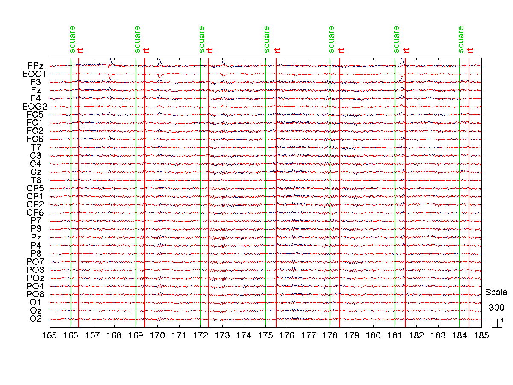

Regressing out ocular artifacts
===

This tutorial illustrates how _meegpipe_ can be used to correct ocular 
artifacts using a classical technique: regressing out one or more reference
EOG signals from your EEG data. 

## The sample dataset

For this tutorial we will use the sample (epoched) dataset that comes with
[EEGLAB][eeglab]. You can find it on the `sample_data` directory within 
your EEGLAB's installation directory. You can also get it from here:

http://kasku.org/data/meegpipe/eeglab_data_epochs_ica.zip

[eeglab]: http://sccn.ucsd.edu/eeglab/


## Least squares regression

The easiest way of regression consists on using the whole EEG dataset to 
learn the regression filter weights. Despite its simplicity, this approach 
often produces good results. 

Before anything else we need to initialize _meegpipe_. You need to do this
only once (for each MATLAB session):

````matlab
% You may consider adding this line to your startup file
meegpipe.initialize
```` 

Let's create a simple processing pipeline to perform the EOG regression. 
The first node in our pipeline needs to take care of reading the 
data from the disk file, which is in EEGLAB's `.set/.fdt` format:

````matlab
myNode1 = meegpipe.node.physioset_import.new(...
    'Importer', physioset.import.eeglab);
````

The second node will perform the actual regression:

````matlab
% Will use a multiple-lag regression filter of order 10 (default is 3)
myNode2 = aar.eog.regression('Order', 5);
````

We can now build a pipeline out of the two nodes above:

````matlab
% We set GenerateReport to false to speed up processing
myPipe = meegpipe.node.pipeline.new(...
    'NodeList',         {myNode1, myNode2}, ...
    'GenerateReport',   false);
````

And finally we can run the processing pipeline on the relevant data file:

````matlab
cleanData = run(myPipe, 'eeglab_data_epochs_ica.set');
````

Let's compare the cleaned and the original data:

````matlab
% The original data
origData = import(physioset.import.eeglab, 'eeglab_data_epochs_ica.set');
plot(origData, cleanData);
````


As you can see, simple regression does minimize the ocular artifacts, but 
leaves quite some residuals behind. One reason for this poor performance is
that our regression filter is not able to adapt to intrinsically 
non-stationary events such as blinks or saccades. 


## Adaptive regression

To tackle non-stationarity, we could regress out the EOG reference signals
using an adaptive filter that re-learns the regression weights at each
time instant, using only past data according to a forgetting factor. For
this approach to be computationally feasible one has to learn the 
regression weights using adaptive algorithms such as a 
[Recursive Least Squares (RLS)][rls]. However, most adaptive filters 
(especially RLS-based) can easily become unstable and are hardly suitable
for processing long-duration EEG datasets. There are ways to overcome 
these stability problems at the expense of increasing the complexity of the
algorithm, but at this point `meegpipe` does not implement any such stable
adaptive filter (but see [1]). 

What `meegpipe` does implement is a way of performing simple least squares
regression in sliding (overlapping) windows. This approach does not have
stability issues and is very effective at removing ocular artifacts. The 
obvious downside is that computation time can be considerably longer than 
for truly adaptive (e.g. RLS-based) algorithms.  

[rls]: http://en.wikipedia.org/wiki/Recursive_least_squares_filter

The following code snippet will regress out the EOG signals from the EEG 
channels, in sliding windows of 2 seconds, with 90% overlap between 
correlative windows, using a multiple lag regression filter of order 3:

````matlab
myNode1 = meegpipe.node.physioset_import.new(...
    'Importer', physioset.import.eeglab);
myNode2 = aar.eog.adaptive_regression(...
    'Order',          3, ...
    'WindowLength',   2, ...
    'WindowOverlap',  90);
myPipe = meegpipe.node.pipeline.new(...
    'NodeList',         {myNode1, myNode2}, ...
    'GenerateReport',   false);
cleanData = run(myPipe, 'eeglab_data_epochs_ica.set');
````

Let's compare the cleaned and the original data:

````matlab
% The original data
origData = import(physioset.import.eeglab, 'eeglab_data_epochs_ica.set');
plot(origData, cleanData);
````



As expected, sliding-window regression is more effective at removing 
ocular activity. 

## References

[1] _The Automatic Artifact Removal (AAR) plug-in for EEGLAB_. Available at:
http://germangh.com/aar

[2] Liavas and Regalia, _On the numerical stability and accuracy of the 
conventional recursive least squares algorithm_, IEEE Transactions on 
Signal Processing, 47 (1), 1999. DOI: [10.1109/78.738242](http://dx.doi.org/10.1109/78.738242)
